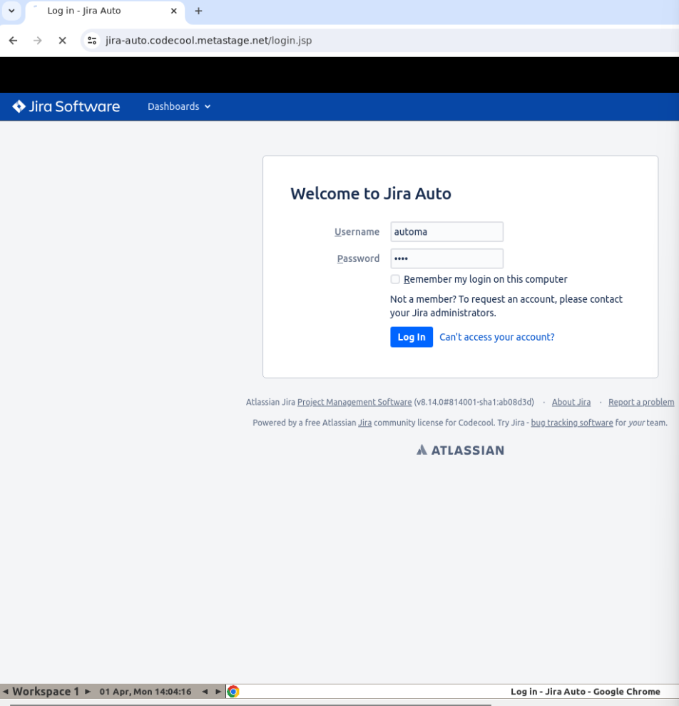

To run selenium in docker in terminal type command:
```angular2html
docker-compose -f docker-compose-v3.yml up
```

This command say, run docker-compose up from file docker-compose-v3.yml
This yml file is form  https://github.com/SeleniumHQ/docker-selenium where hopefully will be applied updates

Now you can open localhost:4444, and see the following picture:


In your project, where you defined your driver:
```
WebDriver driver = new ChromeDriver();
```
you should chane the driver to : 
```
        DesiredCapabilities cap= new DesiredCapabilities();
        cap.setBrowserName("MicrosoftEdge");
        try {
            driver= new RemoteWebDriver(new URL("http://localhost:4444/wd/hub"),
                    cap);
        } catch (MalformedURLException e) {
            throw new RuntimeException(e);
        }
```
or in this version I didn't use URL as it is deprecated:
```angular2html
        DesiredCapabilities cap= new DesiredCapabilities();
        cap.setBrowserName("firefox");
        URI gridURL;
        try {
           gridURL = new URI("http://localhost:4444/wd/hub");
        } catch (URISyntaxException e) {
            throw new RuntimeException(e);
        }
        try {
            driver= new RemoteWebDriver(gridURL.toURL(),
                    cap);
        } catch (MalformedURLException e) {
            throw new RuntimeException(e);
        }
```
I can simple run my tests, and it will be executed in docker without opening a page.


If you want to see what happening in your container you will need a VNC viewer.
I installed RealVNC Viewer. If you do so, you should create a connection for localhost:5900 chrome, localhost:5906 edge, localhost:5907 for firefox
If you will be asking password it is 
```
secret
```

The documentation description about this is:
```
Using a VNC client
The VNC server is listening to port 5900, you can use a VNC client and connect to it. Feel free to map port 5900 to any free external port that you wish.

The internal 5900 port remains the same because that is the configured port for the VNC server running inside the container. You can override it with the SE_VNC_PORT environment variable in case you want to use --net=host.

Here is an example with the standalone images, the same concept applies to the node images.

$ docker run -d -p 4444:4444 -p 5900:5900 --shm-size="2g" selenium/standalone-chrome:4.19.0-20240328
$ docker run -d -p 4445:4444 -p 5901:5900 --shm-size="2g" selenium/standalone-edge:4.19.0-20240328
$ docker run -d -p 4446:4444 -p 5902:5900 --shm-size="2g" selenium/standalone-firefox:4.19.0-20240328
Then, you would use in your VNC client:

Port 5900 to connect to the Chrome container
Port 5901 to connect to the Edge container
Port 5902 to connect to the Firefox container
If you get a prompt asking for a password, it is: secret. If you wish to change this, you can set the environment variable SE_VNC_PASSWORD.

If you want to run VNC without password authentication you can set the environment variable SE_VNC_NO_PASSWORD=1.

If you want to run VNC in view-only mode you can set the environment variable SE_VNC_VIEW_ONLY=1.

If you want to modify the open file descriptor limit for the VNC server process you can set the environment variable SE_VNC_ULIMIT=4096.
```
Now you can see the execution of your tests: 


the execution: 




